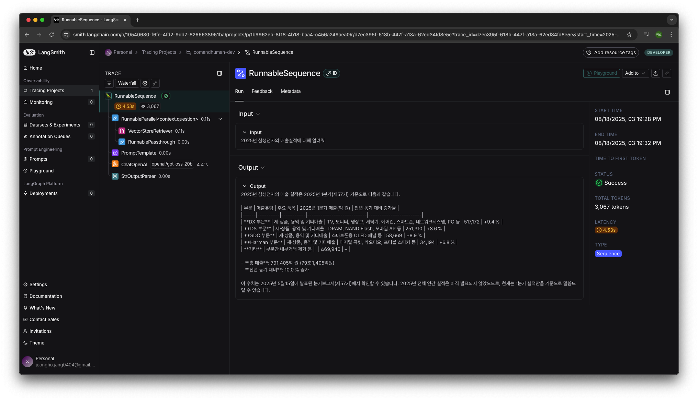
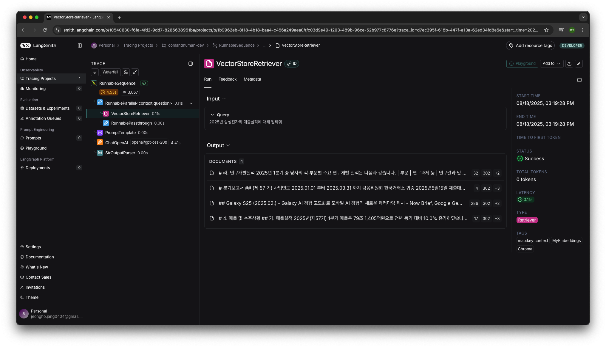

## Indexing


### Raw data


- PDF
- 다수의 표

### Parsing


- 랭체인의 Document Loader를 이용하여 **마크다운 문법**으로 텍스트를 추출
- 랭체인 프레임 워크를 이용하기 위해 [**Custom Document Loader**](https://python.langchain.com/docs/how_to/document_loader_custom/)구현
- native가 아닌 프레임워크의 커스텀 기능을 이용한 이유
  - Document 표준 인터페이스로 **Splitter/Embedding/Retriever/VectorStore**에 바로 연결
    - Loader 콜백/트레이싱, 지연 로딩(lazy), 리소스 관리 등 **프레임워크**를 적극 활용하기 위함

### Chunking

| 이름    | 이미지                                                                             |
| ------- | ---------------------------------------------------------------------------------- |
| raw     |                |
| parsed  |  |
| chunked |                |

- 랭체인의 MarkdownHeaderTextSplitter를 이용하여 **헤더**를 경계로 자름


- 임베딩 할 모델의 토크나이저를 이용하여 나눠진 문서의 토큰 확인
- Qwen3-Embedding-8B를 메모리 문제로 인해 최대 토큰을 8,192로 제한하여 로드함, 분할된 문서의 최대 토큰 수가 3,000 이하이므로 문제 없음

### Embedding

- Qwen3-Embedding-8B 모델을 이용하여 임베딩
- 랭체인에서 제공하는 임베딩 클래스는 파라미터(양자화, 토큰, temperature)를 수정하기 어려움
  - Transfomers나 Sentence Transformers를 사용해야 함
- 랭체인의 embedding 클래스를 이용하기 위해 [**Custom Embeddings**](https://python.langchain.com/docs/how_to/custom_embeddings) 를 이용하여 Transformers 기반 임베딩 모델을 LangChain 커스텀 클래스로 구현해야 함
  - `LangChain DocumentLoader` -> `LangChain TextSplitter` -> `LangChain Embeddings` -> `LangChain VectorStore`
  - 단계별 요소들이 매끄럽게 연동되도록, 커스텀 컴포넌트가 필요함
- Chroma DB에 저장

## RAG


```python
chain = (
	{"context": retriever, "question": RunnablePassthrough()}
	| prompt
	| llm
	| StrOutputParser()
)
```

- 가장 기초적인 naive RAG구현



- 별다른 지시를 하지 않아 context로 넣어진 마크다운 문법을 따라서 출력도 마크다운 문법으로 함



- rerank과정을 거치지 않아 질문의 답이 있는 문서가 가장 하위에 위치함

## Troubleshooting

### PDFPlumber & Semantic Chunker

- 원인

  - PDFPlumber가 텍스트를 올바르게 파싱하지 못함
  - 이로 인해 토크나이저가 문자를 인식하지 못함

- 문제
  - Semantic Chunker가 문장의 의미 단위로 분할하지 못하고 정상적으로 작동하지 않음
  - 인식되지 않은 문자는 토큰 크기가 커짐
  - 그 결과 Semantic Chunker가 사용하는 임베딩 모델에서 **OOM(Out Of Memory)** 발생

### google/gemma-3-27b-it

- 성능의 한계로 첨부한 이미지 내 표를 마크다운 문법으로 추출하지 못함

### openai/gpt-oss-20b

- 문제

  - vLLM 엔진 오류가 지속적으로 발생

- 원인

  - [**가이드**](https://cookbook.openai.com/articles/gpt-oss/run-vllm)는 NVIDIA H100과 같은 서버용 전용 GPU 환경을 전제로 작성됨
  - 로컬 환경(소비자용 GPU)에서 추론을 시도할 경우 오류 발생 가능

- 해결
  - H100 사용
